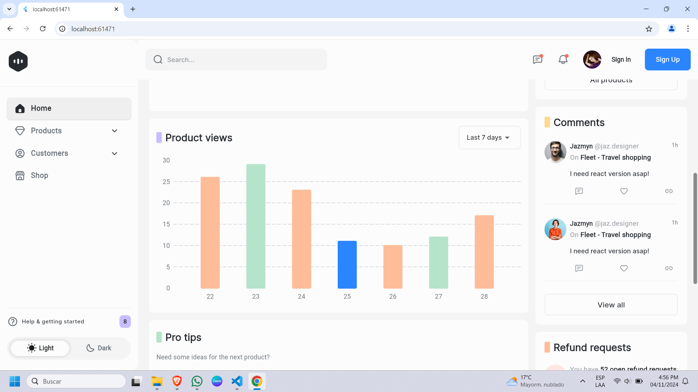

# Core Dashboard

Core Dashboard es un proyecto Flutter diseñado para ser una aplicación web responsive. Esta aplicación se adapta a diferentes tamaños de pantalla, proporcionando una experiencia de usuario óptima tanto en dispositivos móviles como en tablets y escritorios.

## Características

- **Responsive Design**: La aplicación se adapta automáticamente a diferentes tamaños de pantalla.
- **Interfaz de Usuario Moderna**: Utiliza componentes de Flutter para una apariencia y sensación modernas.
- **Fácil Navegación**: Incluye un menú lateral y una barra de navegación intuitiva.

## Capturas de Pantalla

### Versión de Escritorio


### Versión Móvil


## Instalación

1. Clona el repositorio:
    ```sh
    git clone https://github.com/tu_usuario/core_dashboard.git
    ```
2. Navega al directorio del proyecto:
    ```sh
    cd core_dashboard
    ```
3. Instala las dependencias:
    ```sh
    flutter pub get
    ```
4. Ejecuta la aplicación:
    ```sh
    flutter run
    ```

## Contribución

Si deseas contribuir a este proyecto, por favor abre un issue o envía un pull request.

## Licencia

Este proyecto está bajo la Licencia MIT.